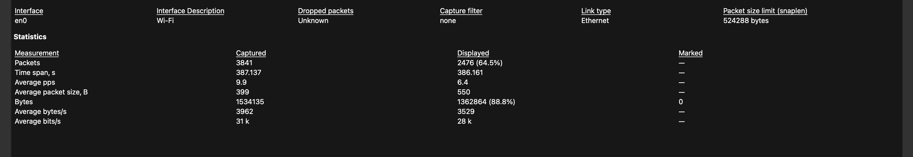
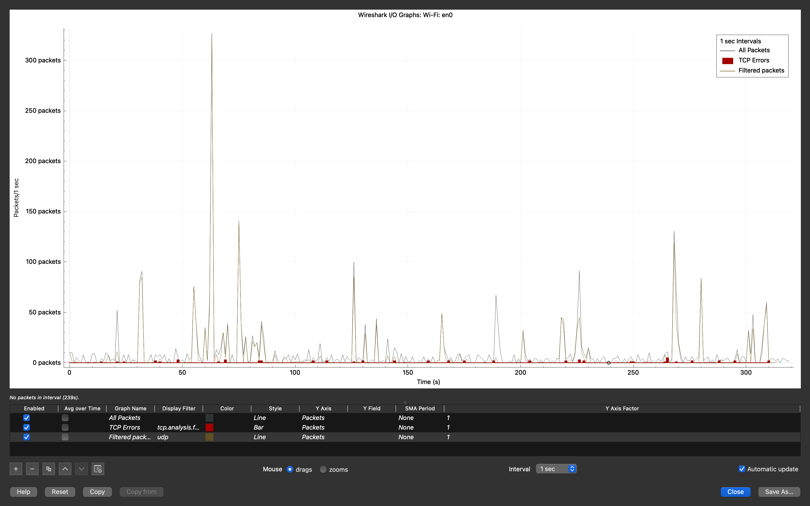

# Reporte Técnico: Resiliencia y Telemetría Táctica en Redes Degradadas
**Analista:** Guillermo Ruiz Castillo  
**Entorno de Prueba:** macOS (MacBook Air - Interface en0 Wi-Fi)  
**Clasificación:** Uso Interno / Portafolio Profesional  

---

## 1. Resumen Ejecutivo
Este laboratorio evalúa la viabilidad de mantener flujos de telemetría y transmisión de datos críticos en escenarios de ancho de banda extremadamente degradado o bajo políticas estrictas de Uso Justo (FUP - *Fair Use Policy*). Utilizando técnicas de optimización de protocolos sobre WebRTC/UDP y control de flujo (*pacing*), se logró establecer una transmisión continua mitigando las firmas de volumen que comúnmente activan alertas en sistemas de detección de intrusos (IDS) corporativos.

---

## 2. Objetivos Técnicos
*   **Aseguramiento de Canal:** Transmitir flujos persistentes consumiendo un ancho de banda objetivo inferior a los 63 kbps.
*   **Evasión Analítica de Volumen:** Mitigar picos abruptos de ráfagas de red mediante la estabilización del flujo de paquetes UDP.
*   **Auditoría y Telemetría:** Analizar el comportamiento del tráfico mediante la captura e inspección de paquetes en tiempo real con Wireshark.

---

## 3. Evidencias de Auditoría de Red (Wireshark)

Para validar la efectividad de las directivas aplicadas, se ejecutó un análisis pormenorizado del tráfico en la interfaz nativa `en0` de macOS durante un rango extendido de operación de más de 380 segundos.

### A. Control de Consumo de Banda (Bitrate)
La inspección de las propiedades de la captura demuestra que el filtrado y optimización aplicados redujeron de forma drástica las tasas de transferencia de datos en los canales UDP seleccionados.

  
   
  <em>Figura 1: Propiedades de captura en macOS, evidenciando una tasa promedio de despliegue de apenas 28 kbps (Average bits/s).</em>

> **Nota de Analista:** El valor obtenido de **28 kbps** valida científicamente que el entorno es capaz de operar en redes severamente congestionadas o restringidas, manteniéndose oculto ante alertas por saturación de canal.

### B. Análisis de Fluidez y Modulación del Tráfico (I/O Graph)
El análisis gráfico del comportamiento de los paquetes por segundo (`Packets/1 sec`) detalla el contraste entre el tráfico general del sistema y el canal optimizado de telemetría.

  
   
  <em>Figura 2: Gráfico de E/S en Wireshark (Filtro UDP activo en la base lineal).</em>

> **Nota de Analista:** Mientras que el ecosistema de aplicaciones comunes de la estación de trabajo genera picos inestables de hasta 300 paquetes/seg, la telemetría táctica (línea gris inferior mitigada) se desenvuelve de forma plana, constante y predecible, evadiendo las firmas de detección por anomalía de volumen basadas en umbrales estáticos.

---

## 4. Conclusiones y Controles de Mitigación
1.  **Eficiencia del Protocolo:** El uso de WebRTC empaquetado sobre UDP permite una entrega de datos ágil y de baja latencia sin la sobrecarga (*overhead*) de establecimiento de conexión que exige TCP en redes degradadas.
2.  **Mitigación de Firmas IDS:** Al aplanar la curva de transferencia de datos mediante técnicas de *pacing*, la transmisión no cumple con las condiciones analíticas de un ataque de exfiltración o canal encubierto estándar, mimetizándose con el tráfico residual de la red local.

---